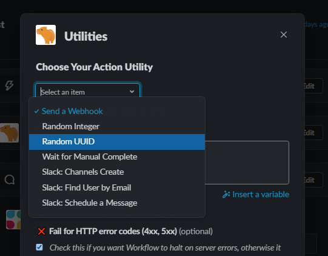

# Workflow Buddy - Super powers for Workflow Builder

---

**[Workflow Builder](https://slack.com/features/workflow-automation) is great!**

**... and it has great potential, too!** 😅

The current implementation you get out of the box is a bit boxed in by:

- a small selection of built-in Slack triggers (`5`)
  - _shortcut, new channel member, emoji reaction, schedule, webhook_
- a **_VERY_** limited selection of built-in Slack actions (`2`)
  - _send a message, send a form_

_You can get creative and do a lot with these building blocks, but what if you want to do **more**?_

### 🥳 ✨ **Ta-da!** ✨

**This Slack App acts as an extension of Workflow Builder, providing access to significantly more Slack triggers (such as `app_mention`, `channel_created`, etc.) and expanding the suite of Steps available.**

⚡ The most important **Step** this app adds is the `Outgoing Webhook`, which enables users to integrate their Slack Workflow Steps with almost any other application.

> **[ℹ️]** Alpha Disclaimer:
> 
> This code is in alpha stage on it's way to a stable v1. It's fully functional, but still needs resiliency features like retrying failed webhooks, retrying Slack API calls when rate-limited, etc.
>

- **About**
  - [Available Event Triggers](#🏁🎬-available-triggers) - `Many`
  - [Available Steps](#🏃available-steps) - `7`
  - [Use Cases](#use-cases)
- **Quick Start** - 🎉 _test me out!_ 🧪
  - [Run Local Server](#run-local-server)
  - [Try New Event Triggers](#quickstart-new-event-triggers)
  - [Try New Steps](#quickstart-new-steps)
- [Development](#development)
- [Deployment: Self-hosting, Hosted](#deployment)

---

## 🏁🎬 Available Triggers

All\* [Slack events](https://api.slack.com/events) proxied through to any **_webhook-triggered_** Workflows.\*\* See _"Templates to save time"_ for copyable webhook starting points.

> _\*During alpha stage, only a small number of events have been implemented, but goal is to quickly update to handle 80-90% of uses cases, and eventually 100%._
> _\*\* While WorkflowBuddy code will work out of the box as an event proxy, you will need to update your app's OAuth scopes & event subscriptions for your new events, as well as save the webhook event from your Workflow in the config._


### Templates for Event Triggers

When using **Workflow Builder Webhooks**, it requires allow-listing any data keys you want to use from the request body. To make this easier, in `event_trigger_example_workflows/`, you can find templates that already have all the requisite keys already in place, matching the [core payload from the Slack API](https://api.slack.com/events?).

> ⚠️**Limitations**
>
> - [Slack restrictions](https://slack.com/help/articles/360041352714-Create-more-advanced-workflows-using-webhooks)
>   - Max of `20` variables allowed.
>   - Cannot handle nested JSON.
>   - Workflow fails if all variables not present.
> - Workflow Buddy
>   - Only a small number of templates have been completed so far, good contribution opportunity!
>   - Currently the [wrapping payload](https://api.slack.com/types/event) is not included, but it could be an easy contribution in the future.

## 🏃 Available Steps

The utilities currently available within WorkflowBuddy for use as Workflow Steps. To see the exact inputs & outputs without loading up Workflow Builder, see [constants.py](https://github.com/happybara-io/WorkflowBuddy/blob/main/constants.py).



### Send a Webhook

Send data from your Slack Workflows to almost any service. You can trigger GitHub repos, Jenkins Builds, Salesforce actions, you name it.

### Wait for human | approval | manual completion

Many names to describe it. In short, have your workflow wait in an `In progress` state until a human has taken action to either `Complete`➡ and let the Workflow continue, or `Fail`❌ it and stop the flow.

### Random Integer

Generate a random integer in the range [`lower_bound`-`upper_bound`], inclusive.

**Example**: Given `5` - `15`, would output random value like `11`.

### Random UUID

Generate a random UUID with [Python's standard library](https://docs.python.org/3/library/uuid.html).

**Example**: `a3b45ac2-d1ba-4c54-9e1c-0d51983ec952`.

### (Slack) Create a channel

- [Core API Method](https://api.slack.com/methods/conversations.create)

This action will create a new channel with your specified name, then return the `channel_id` as both text & the `channel` type so it can be used in Slack's built-in functions.

### (Slack) Find user by email

- [Core API Method](https://api.slack.com/methods/users.lookupByEmail)

Get a user based on their Slack email. Returns the user as both a text `user_id` and a `user` type so it can be used in Slack's built-in functions.

### (Slack) Schedule a message

- [Core API Method](https://api.slack.com/methods/chat.scheduleMessage)

Schedule bot messages to public channels up to 120 days in the future.

### More to come ....

See [Issue #10](https://github.com/happybara-io/WorkflowBuddy/issues/10) for discussion on potential Step actions to add.

## ⛏ Use Cases

What can you do with these extra triggers and actions?

## Trigger Slack Workflows with (almost) any event

Expand beyond the limited number of events that Workflow Builder comes with out of the box.

### Replace the legacy Outgoing Webhooks

Slack used to offer [Outgoing Webhooks](https://slack.com/apps/A0F7VRG6Q-outgoing-webhooks?tab=more_info) as a way to listen for new messages/Trigger Words in Slack messages and then fire a webhook to external URLs.

It has a warning at the top though _"Please note, this is a legacy custom integration - an outdated way for teams to integrate with Slack. These integrations lack newer features and they will be deprecated and possibly removed in the future."_. To avoid any issues, you can alternatively use WorkflowBuddy to accomplish the same thing (in 2 ways!).

Enable listening for `message`**\*** events, then either directly proxy the event to your webhook (by adding it to the `Event-Webhook Map` in App Home) or use the `Step: Send a Webhook` as part of a longer Workflow.

**\*** _WorkflowBuddy doesn't yet have the same granularity for filtering events, but it is on the potential roadmap._

### Send data from Slack Workflow to other apps

Use the customizable `Outgoing Webhook` Step as part of a workflow and fill the JSON body with relevant context. Examples might be triggering Airtable automations when your Workflow is finished, or kicking off GitHub Actions.

### Proxy Slack events to another service

Workflow Buddy was originally intended for expanding the available Workflow Builder triggers within Slack, but it can also be used to proxy Slack events to another service - bypassing Workflow Builder entirely. This can be done by following parts of the [New Event Triggers Guide](#quickstart-new-event-triggers). You can skip creating a workflow, then after double checking your OAuth scopes are all set, you can `Add` a new event-> webhook mapping and connect the event to your external services URL.

> ℹ️: When using in this advanced manner, you'll want to set your webhook configuration setting `raw_event: true`. Workflow Buddy by default will flatten & limit the JSON it receives to fit with the [Slack limitations](#templates-for-event-triggers) of 20 variables and no nested data.

### Your great idea here

There are tons of awesome use cases we haven't thought of yet, submit a PR or reach out to tell us about yours!

---

## 🏁 Quickstarts

Follow an easy walk-through to get a feel for what the system can do.

### Quickstart: New Event Triggers

We're gonna start with a simple event we can easily control: `app_mention` _(when your bot is `@WorkflowBuddy` in a channel)_. We will use that event to kick off a simple Workflow that just sends us a message.

> ℹ  _If you haven't yet, you'll need to get a [server instance running + a Slack app](#run-local-server). Come back when you're ready._

- **First we'll set up the Workflow we want triggered - in Workflow Builder.**
  - Download the Workflow template from `event_trigger_example_workflows/trigger_app_mention.slackworkflow`[(link)](https://github.com/happybara-io/WorkflowBuddy/blob/main/event_trigger_example_workflows/trigger_app_mention.slackworkflow). You can also start from scratch - the only _**critical**_ step is to choose `Webhook` as your new Workflow's event trigger.
  - Open Workflow Builder, `Import` (or create), and `Publish` it to get your new `Webhook URL`.
- **Open Workflow Buddy App Home to connect Workflow -> Event Trigger.**
  - Go to the `App Home` of Workflow Buddy _(or whatever you named your app)_ and click `Add`. It will display a modal asking you to fill out your desired event trigger & the `Webhook URL` from first step.
- **Test it!**
  - From any public channel, post a message with `@WorkflowBuddy` _(or whatever you named your app)_.
  - That message will cause an `app_mention` event to be sent from Slack to your instance of the Workflow Buddy server.
  - If you correctly configured the `event->webhook` mapping, the event will then be proxied to the test Workflow you added in the first step.
- **That's it!**
  - You now have the abiltity to use all sorts of Slack events as Triggers for your Workflows now! _(⚠ So long as you have given your Slack app the OAuth permissions to use them)._

**Go forth and automate!**

### Quickstart: New Steps

Try out the new **Steps** by importing a Workflow that has all of them configured (except for ones that make changes to your Slack Workspace, like `Create a channel`. Don't want to cause any weird side-effects during your testing!).

> ℹ  _If you haven't yet, you'll need to get a [server instance running + a Slack app](#run-local-server). Come back when you're ready._

- Download the Workflow template from `test_workflows/workflow_buddy_end_to_end_test_read_only.slackworkflow`[(link)](https://github.com/happybara-io/WorkflowBuddy/blob/main/test_workflows/workflow_buddy_end_to_end_test_read_only.slackworkflow), which contains all the basic functionality of Workflow Buddy Steps.
- Open Workflow Builder, `Import`, and `Publish` it!
- _(Optional)_ Click the `Edit` button on each of the configured Steps in the Workflow so you can see how each available action is configured.
- Run the Workflow and check the outputted message for details of the execution.
- **That's it!**
  - You now have the abiltity to use all of the Workflow Buddy Steps for your Workflows now!

**Go forth and automate!**

---

## 👩‍💻 Development

- [Bolt Python](https://slack.dev/bolt-python/)

## Run local server

Run the app locally & connect to your workspace Slack app.

### Setup

- [Create your Slack app](https://api.slack.com/reference/manifests#creating_apps) from the `slack_app_manifest.yml` file.
- Create a `.env` file that looks like:
  ```
  SLACK_BOT_TOKEN=xoxb-********
  SLACK_SIGNING_SECRET=********
  ```

### Run

Use [`ngrok`](https://ngrok.com) to tunnel your local port to the public internet, then run the server with Docker.

```
make ngrok
# (in a separate terminal)
make up
```

### Local Development

Alternative to running it with Docker, run the development server.

- `poetry install` (or install with your preferred Python tool using the `requirements.txt`).
- _(in a separate terminal)_ `make ngrok`.
- `poetry shell` so all our environment variables are easy.
- Run the local dev server with `./run.sh`, or a "prod" server with `./run-prod.sh`.
- Update the Slack App console with new `ngrok` address - for [Event Subscriptions](https://api.slack.com/apps/A040W1RHGBX/event-subscriptions?), Interactivity - this is easiest done by updating the `slack_app_manifest.yml` file and then copying it onto the Manifest page in Slack App console.
- (_Testing Webhooks_) [Handy tool to debug with](https://webhook.site) as well as testing different HTTP error codes [mock.codes](https://mock.codes/).

#### UI/UX Development

For the "UI" block surfaces (especially App Home), highly recommend opening in [Block Kit Builder](https://app.slack.com/block-kit-builder/) with the helper utility `get_block_kit_builder_link()`.

```
# Open Python REPL
>>> import utils
>>> utils.get_block_kit_builder_link(view=utils.build_app_home_view())
# copy the resulting link into address bar, avoiding the '' Python surrounds it with.
```

### How it works

For Slack events, this app basically just acts as a proxy. As long as the event is added to the bot's OAuth scopes, it should be able to proxy it through to your **Workflow Builder** flow.

For the new actions, it registers a **Workflow Builder Step** - unfortunately each app is limited to 10 registered with Slack. To get around that limitation, we have the user select from a static select list of actions that have been implemented on the server, then update the modal to give them the appropriate options. For example, if the user wants to `Send a webhook`, we'll then update the modal to have an input for the Webhook URL, and a text box for the body they want to send.

**Data**: Config data (basically just webhooks for now) is persisted on disk using Using a very simple cache + JSON file to persist webhook config data - it's not very robust, so highly recommend keeping a copy of the JSON file as backup to easily import if config is destroyed.

---

## Deployment

Putting your server somewhere more useful than your local machine.

### Hosted

Don't want to host it yourself? Happybara will be releasing a hosted version in the near future.

[🏄‍♀️ Snag your spot on the waitlist!](https://tally.so/r/mVLKkj)

### Self-hosted options

#### Fly.io

- Add secrets from `.env.example` using [`flyctl secrets`](https://fly.io/docs/reference/secrets/#setting-secrets). Same secrets setup as in Development section.
- (Optional) update `fly.toml` config settings.
- Run `fly deploy`.
- ⚠️ _Using a very simple cache + JSON file to persist webhook config data - it's not very robust, so highly recommend keeping a copy of the JSON file as backup to easily import if config is destroyed._

#### Others

TBD.

---
